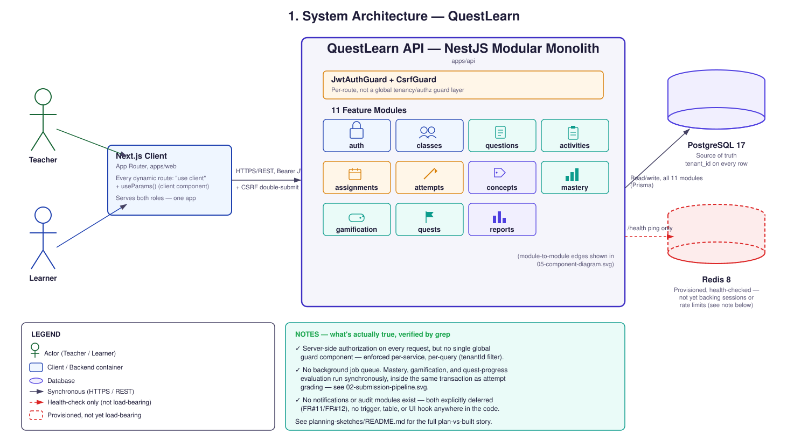

# System Architecture

The actual runtime shape of QuestLearn as built through Module 10 — not
the original planning-stage sketch in the master spec. Two corrections
against that sketch, both confirmed by grep against the real source
before this diagram was drawn:

- **No background worker.** The spec's architecture sketch proposed a
  BullMQ worker for mastery recalculation, badge rules, and
  notification dispatch. It was never built — `bullmq` appears nowhere
  in `package.json` or `apps/api/src`. Mastery, gamification, and
  quest-progress evaluation all run synchronously, inside the same
  database transaction as attempt grading (see
  [`02-submission-pipeline.md`](./02-submission-pipeline.md)).
- **Redis is provisioned but not yet load-bearing.** `ioredis` is a
  dependency, but the only place it's imported anywhere in
  `apps/api/src` is `health/health.service.ts`, for the `/health`
  connectivity check. Rate limiting (`ThrottlerModule.forRoot` in
  `app.module.ts`) uses NestJS's default in-memory store — there's no
  `@nestjs/throttler-storage-redis` (or equivalent) wiring it to Redis.
  Redis is real infrastructure, health-checked and ready for session
  caching or Phase 2's pub/sub, but today it backs nothing an API
  request actually depends on.

**Source:** `apps/api/src/app.module.ts` (module list, global
`ThrottlerGuard`), `apps/api/src/health/health.service.ts` (only
Redis usage), `apps/api/package.json` (no `bullmq`, no Redis-throttler
adapter).
