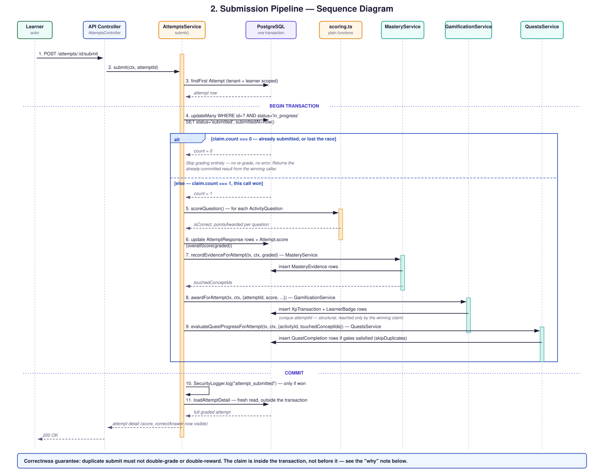

# Submission Pipeline

The correctness-critical flow in the whole system: `POST
/attempts/:id/submit`, handled by `AttemptsService.submit()`. Every
step from the atomic claim onward runs inside one Postgres transaction
— not a chain of separate calls — which is what makes the whole
pipeline safe to re-run under a genuine concurrent double-submit, not
just a sequential retry.

**Why the claim has to be inside the transaction, not before it:** if
the `updateMany` claim and the grading writes were two separate round
trips, a losing concurrent request could read the attempt back after
the winner's claim commits but before the winner's grading commits —
observing `status: "submitted"` with a still-null `score`. Doing both
inside one transaction means Postgres's row lock on the `Attempt` row
forces a losing `updateMany` to block until the winner's transaction
fully commits, so by the time a loser sees `count === 0`, the winner's
grade is already guaranteed visible.

**Source:** `apps/api/src/attempts/attempts.service.ts:266-389`
(`AttemptsService.submit()`), matched to this diagram step by step.
Proven under real concurrency (`Promise.all`, not just sequential
duplicate calls) in
`apps/api/test/attempts/attempts.integration.spec.ts`.
