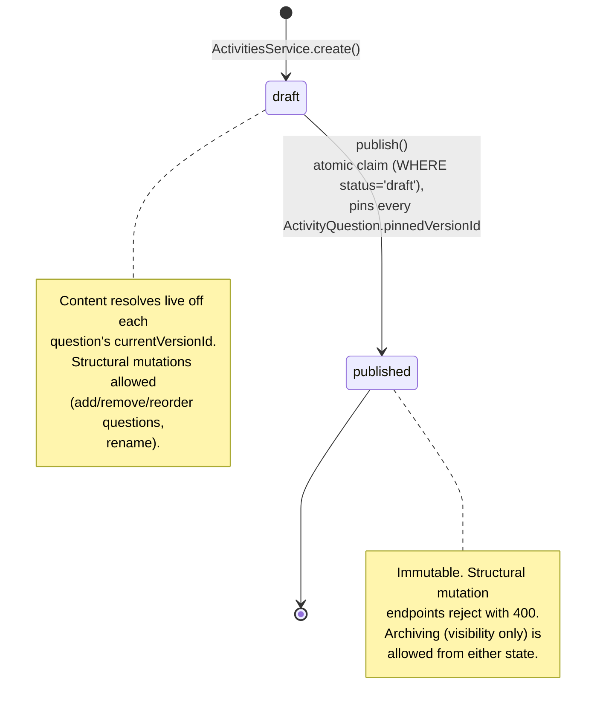
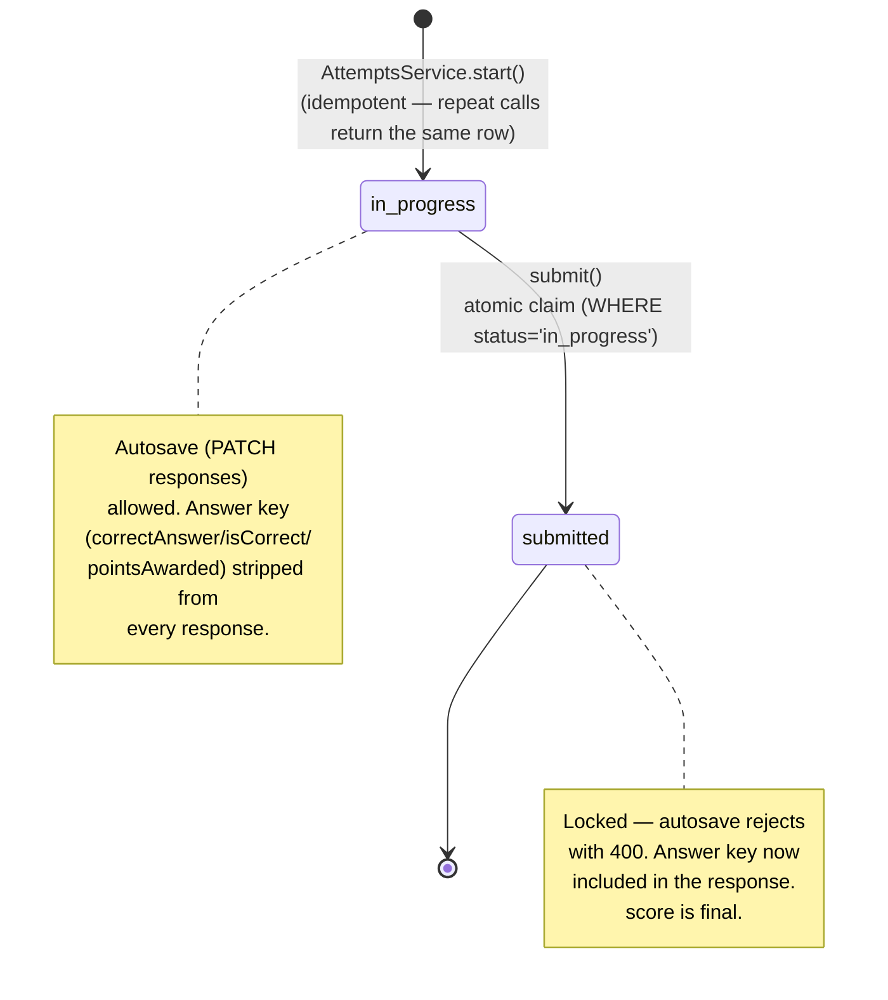
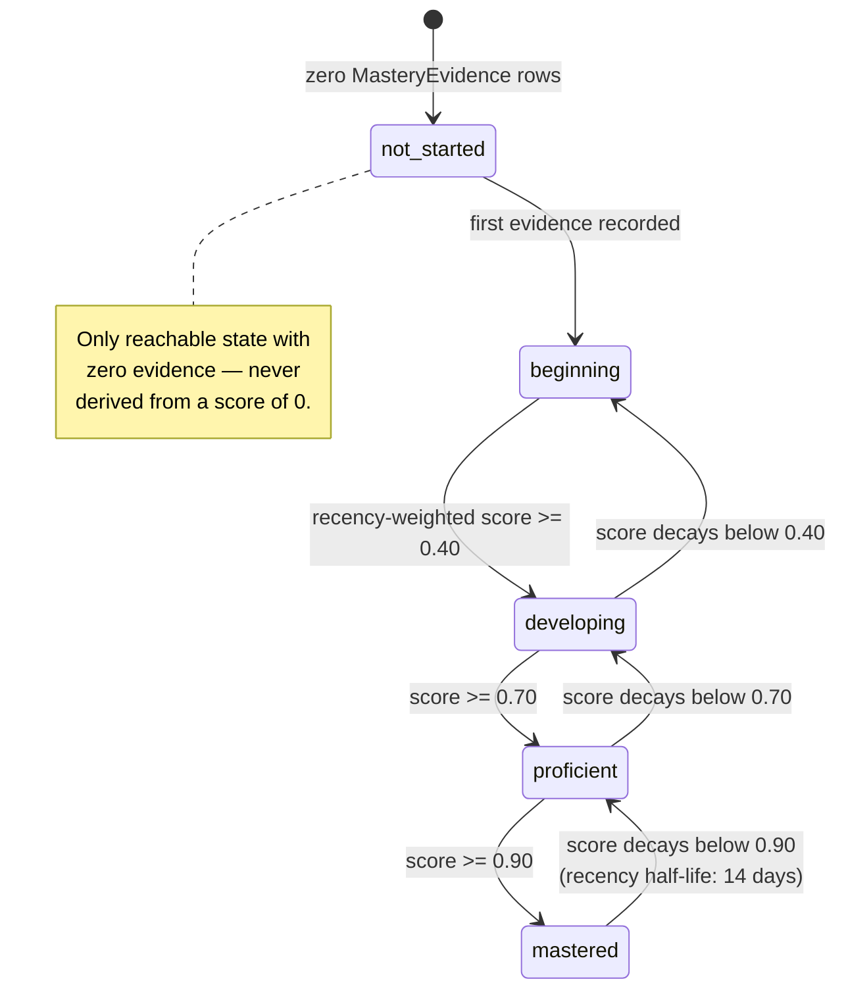

# State Machines

Three independent state machines, each with a genuinely different
shape — none of them share a generic "workflow" abstraction, because
their correctness requirements are different.

## Activity: draft → published

One-way, atomically claimed (`ActivitiesService.publish()`), never
reversible. Publishing pins every `ActivityQuestion` row to its
question's exact current version at that moment — this is what lets
`Attempt` grading trust `pinnedVersionId` unconditionally forever
after, even as the underlying `Question` keeps versioning.

## Attempt: in_progress → submitted

One-way, atomically claimed (`AttemptsService.submit()`) — the exact
transaction detailed in
[`02-submission-pipeline.md`](./02-submission-pipeline.md). A repeat
submit call is a normal idempotent success, not an error.

## Mastery: not_started → beginning → developing → proficient → mastered

Not a stored state at all — there is no `mastery_state` column
anywhere in the schema. Every state shown here is recomputed live, on
every read, from the full history of `MasteryEvidence` rows for a
(learner, concept) pair. The arrows below describe how the computed
state can move as new evidence is recorded or as existing evidence's
recency weight decays — not a stored transition a service ever writes.

**Source:** `apps/api/src/activities/activities.service.ts`
(`publish()`), `apps/api/src/attempts/attempts.service.ts` (`submit()`),
`apps/api/src/mastery/mastery-formula.ts` (`STATE_CUTOFFS`,
`weightedMasteryScore`, `recencyWeight` — score cutoffs 0 / 0.4 / 0.7 /
0.9, 14-day recency half-life, all read directly from the constants).
