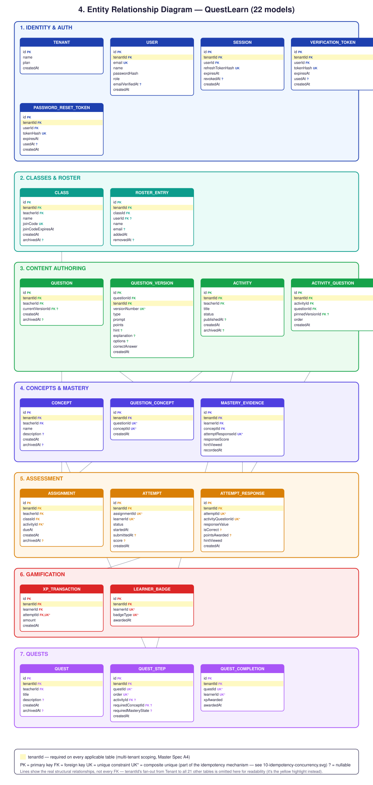

# Entity Relationship Diagram

All 22 models in `apps/api/prisma/schema.prisma`, grouped by bounded
context, every field transcribed from the schema — not abbreviated.
`tenantId` is highlighted (yellow) on every entity except `Tenant`
itself — the multi-tenant scoping the whole app enforces at the
service layer, per Master Spec §6.1 (A4).

Unique constraints beyond the primary key are marked `UK`/`UK*`
because several of them ARE the idempotency mechanism, not incidental
data integrity — see
[`10-idempotency-concurrency.md`](./10-idempotency-concurrency.md).
Relationship lines show the real structural spine (the FKs that define
each bounded context's shape), not all 40+ FKs in the schema —
`tenantId`'s fan-out from `Tenant` to all 21 other tables is
represented by the yellow highlight instead of 21 individual lines,
which would be unreadable at this scale without adding any information
the highlight doesn't already carry.

**No `mastery_state` table exists** — deliberately. Mastery is always
derived live from `MASTERY_EVIDENCE`; see
[`03-state-machines.md`](./03-state-machines.md).

**Source:** `apps/api/prisma/schema.prisma`, all 22 models, verified
field-by-field. Grouping (Identity & Auth, Classes & Roster, Content
Authoring, Concepts & Mastery, Assessment, Gamification, Quests)
matches the bounded contexts in
[`15-ddd-context-map.md`](./15-ddd-context-map.md).
