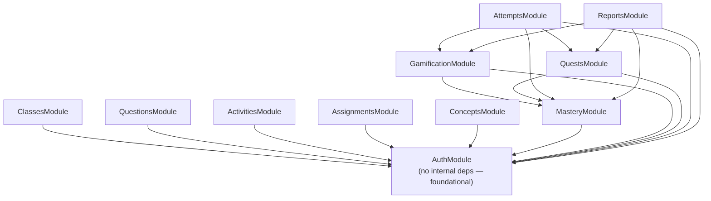

# Component Diagram

The 11 real NestJS modules and their actual `imports: [...]` edges —
every arrow below was confirmed by grepping each `*.module.ts` file
for its imports, not inferred from what the modules "should" depend
on.

**Not built as separate modules**, despite appearing as distinct boxes
in the master spec's original architecture sketch:

- **Scoring** — `scoreQuestion`/`overallScore` are plain exported
  functions in `apps/api/src/attempts/scoring.ts`, used only by
  `AttemptsModule`. Never split into its own module because nothing
  outside attempts grading calls them.
- **Tenancy** — there's no `TenancyModule` or global tenant-context
  guard. Every service enforces tenant scoping itself, via an explicit
  `where: { tenantId: ctx.tenantId }` on each query — see
  [`13-data-flow-threat-model.md`](./13-data-flow-threat-model.md).
- **Notifications** — FR#11 in the master spec, explicitly deferred.
  No module, no table, no trigger call anywhere in the codebase.

**Source:** `apps/api/src/*/​*.module.ts` — every edge above is a
literal `imports: [...]` entry, verified by grep across all 11 module
files.
