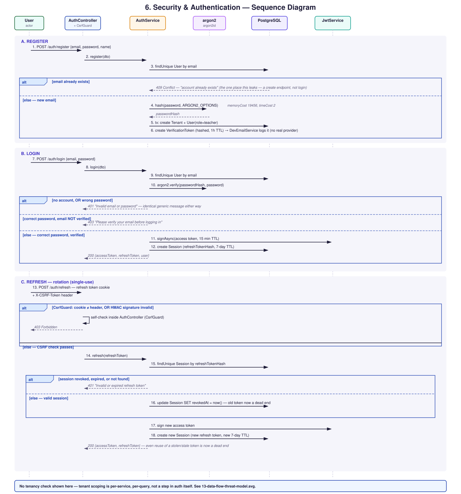

# Security & Authentication Sequence

Register → login → refresh rotation → CSRF-checked cookie endpoints,
matching `AuthService` and the two auth guards exactly.

**Tenant isolation is not shown as a separate guard step above**
because there isn't one — it's enforced per-service, per-query. See
[`13-data-flow-threat-model.md`](./13-data-flow-threat-model.md) for
how a request reaches a tenant-scoped resource after authentication.

**Source:** `apps/api/src/auth/auth.service.ts` (`register`, `login`,
`issueSession`, `refresh`), `apps/api/src/auth/guards/csrf.guard.ts`,
`apps/api/src/auth/csrf.util.ts` (HMAC double-submit), all constants
(`ACCESS_TOKEN_TTL_SECONDS = 900`, `REFRESH_TOKEN_TTL_MS = 7 days`,
`ARGON2_OPTIONS`) read directly from source, not approximated.
