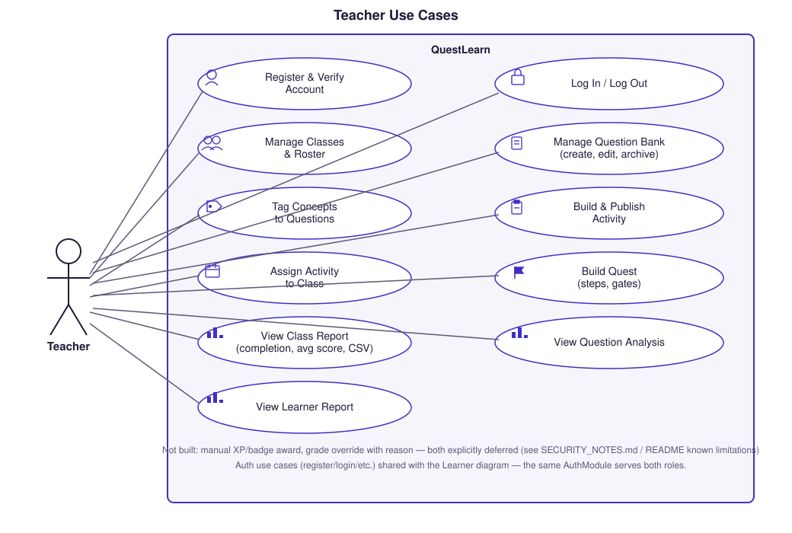
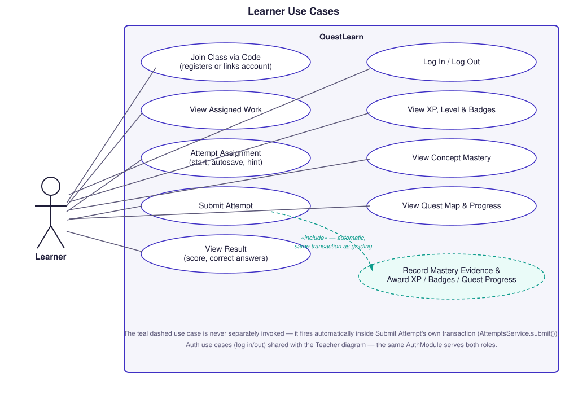

# Use Case Diagrams

Hand-crafted SVG, not Mermaid — Mermaid has no native use-case diagram
syntax, and an actor/action graph approximation wouldn't carry real
UML notation (system boundary, actor figures, association lines,
`«include»` relationships). Both are grounded in the real controller
endpoints and page routes, not a generic "what a system like this
does" guess.

## Teacher

Every bubble maps to a real, currently-reachable capability — `Manage
Classes & Roster` covers `ClassesController`'s create/rename/archive/
roster/rotate-join-code endpoints, `Build & Publish Activity` covers
`ActivitiesController`'s add/reorder/preview/publish, and so on.

**Explicitly not shown**, because they were never built: manually
awarding XP or a badge, and overriding a graded score with a reason.
Both appear in the master spec's original user stories but are
deferred — `GamificationController` exposes only `GET
/gamification/profile` (read-only), and there is no grade-override
endpoint anywhere in `AttemptsController`. Drawing them would
misrepresent the system.

## Learner

The teal, dashed `Record Mastery Evidence & Award XP / Badges / Quest
Progress` bubble is deliberately drawn differently from the rest — a
learner never invokes it directly. It's connected to `Submit Attempt`
with a `«include»` relationship because that's what actually happens:
`AttemptsService.submit()` records mastery evidence, awards XP/badges,
and evaluates quest progress inside the *same* database transaction as
grading, every time, unconditionally. See
[`02-submission-pipeline.md`](./02-submission-pipeline.md) for the
exact sequence.

**Source:** `apps/api/src/*/*.controller.ts` (every `@Get`/`@Post`/
`@Patch`/`@Delete` route across all 11 modules), `apps/web/src/app/`
(the real page routes: `classes`, `questions`, `activities`,
`assignments`, `concepts`, `quests`, `reports`, `mastery`, `xp`,
`join`).
