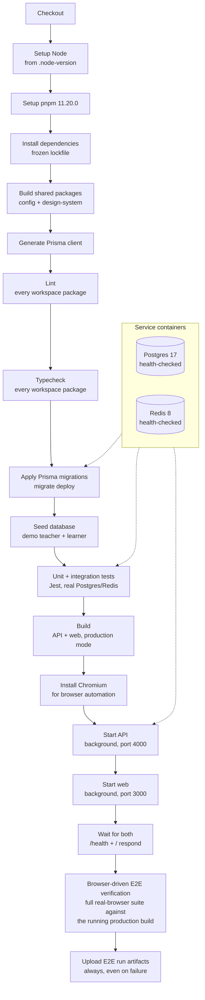

# CI/CD Pipeline

The real stage order from `.github/workflows/ci.yml`, triggered on
every push to `main` and every pull request into it. One job, real
Postgres 17 and Redis 8 service containers (not mocks), sequential
stages.

A failure at any stage before **Q** stops the pipeline before a
browser is ever launched — lint/typecheck/unit-test failures are
caught cheaply, before the cost of starting both real servers and
running a full browser suite against them.

**Source:** `.github/workflows/ci.yml`, every stage name and order
transcribed directly from the real `steps:` list — nothing
paraphrased or reordered for narrative flow.
