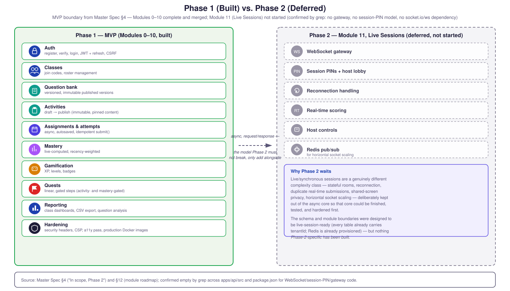

# Phase 1 (Built) vs. Phase 2 (Deferred)

The MVP boundary from Master Spec §4, and where the project actually
stands: Modules 0–10 are complete and merged; Module 11 (Live
Sessions) has not been started — no tables, gateways, or APIs for it
exist anywhere in the codebase (confirmed by grep: no WebSocket
gateway, no session-PIN model, no `socket.io`/`ws` dependency).

**Why Phase 2 waits:** live/synchronous sessions are a genuinely
different complexity class — stateful rooms, reconnection, duplicate
real-time submissions, shared-screen privacy, horizontal socket
scaling — deliberately kept out of the async core so that core could
be finished, tested, and hardened first. The database and module
boundaries were designed to be live-session-ready (every table already
carries `tenantId`; Redis is already provisioned, see
[`01-system-architecture.md`](./01-system-architecture.md)), but
nothing Phase 2-specific has been built.

**Source:** Master Spec §4 ("In scope, Phase 2") and §12 (module
roadmap); confirmed empty by grep across `apps/api/src` and
`package.json` for any WebSocket/session-PIN/gateway code.
