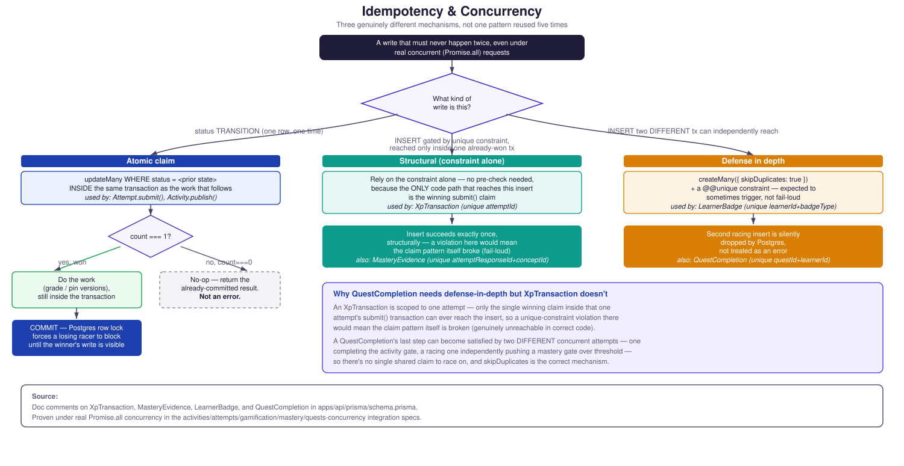

# Idempotency & Concurrency

Three genuinely different mechanisms, not one pattern reused five
times. Flattening them into a single generic "claim pattern" box would
misrepresent the two write shapes that don't use a claim at all.

**Why `QuestCompletion` needs defense-in-depth but `XpTransaction`
doesn't:** an `XpTransaction` is scoped to one attempt — only the
single winning claim inside that one attempt's `submit()` transaction
can ever reach the insert, so a unique-constraint violation there
would mean the claim pattern itself is broken (fail-loud, genuinely
unreachable in correct code). A `QuestCompletion`'s last step can
become satisfied by two **different** concurrent attempts — one
completing the activity gate, a racing one independently pushing a
mastery gate over threshold — so there's no single shared claim to
race on, and `skipDuplicates` is the correct, expected-to-sometimes-
trigger mechanism, not a defensive fallback for a bug.

**Source:** doc comments on `XpTransaction`, `MasteryEvidence`,
`LearnerBadge`, and `QuestCompletion` in
`apps/api/prisma/schema.prisma`; proven under real `Promise.all`
concurrency in `apps/api/test/activities/activities.integration.spec.ts`,
`apps/api/test/attempts/attempts.integration.spec.ts`,
`apps/api/test/gamification/gamification.integration.spec.ts`,
`apps/api/test/mastery/mastery.integration.spec.ts`, and
`apps/api/test/quests/quests-concurrency.integration.spec.ts`.
