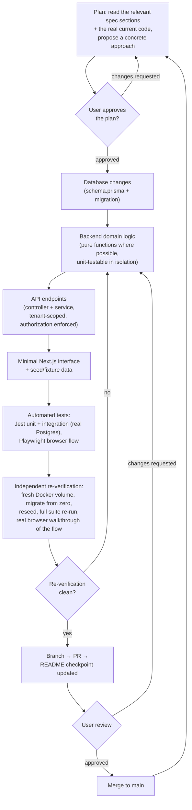

# SDLC / Vertical Slice Workflow

The process every module (0 through 10) actually went through — Master
Spec §13's vertical-slice ordering, combined with the branch/PR/review
discipline §16 requires. Not an idealized process description: this is
the sequence this repository's own commit and PR history reflects,
module after module.

**What "independent re-verification" means concretely**, every time:
`docker compose down -v && up` (a genuinely fresh Postgres/Redis
volume, not reused state), migrations applied from zero, the seed
script re-run, the full Jest suite re-run against that fresh database,
and a real browser-driven walkthrough of the module's flow against a
production build (`next build && next start`, never `next dev` — React
StrictMode's dev-only double-invoke behavior can mask real bugs that a
production build won't have).

**Source:** Master Spec §13 (the vertical-slice development section's
9-step list) and §16 (git policy: branch → PR → CI → review → merge,
even solo). Matches the actual commit/PR sequence for every one of
Modules 0–10 in this repository's history.
