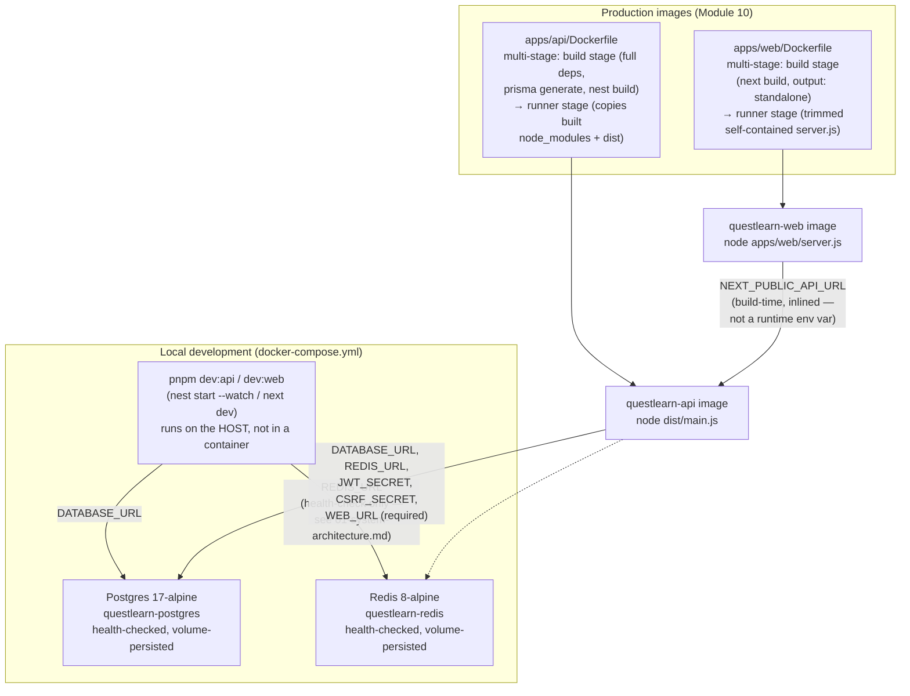

# Local Infrastructure & Environment

Two distinct things, not one: `docker-compose.yml` runs *local
development infrastructure only* (Postgres + Redis) — it has never run
the app itself. The two application Dockerfiles, added in Module 10,
are a separate, later addition for production images.

**Why the API image is larger than the web image (~297MB vs. ~86MB
compressed):** the API runner stage copies the build stage's full
`node_modules` (devDependencies included) rather than a scoped
production-only install — the workspace root's `postinstall` script
runs on every `pnpm install` regardless of `--prod` and has no `tsc`
to build with once devDependencies are stripped. A documented
tradeoff for build reliability, not an oversight (see
`SECURITY_NOTES.md`). The web image avoids this entirely by using
Next's `output: "standalone"`, which traces the real runtime
dependency graph into a minimal, self-contained bundle.

**Source:** `docker-compose.yml`, `apps/api/Dockerfile`,
`apps/web/Dockerfile`, `apps/web/next.config.js` (`output:
"standalone"`, gated behind a `DOCKER_BUILD` flag — see that file's
own comments for why).
