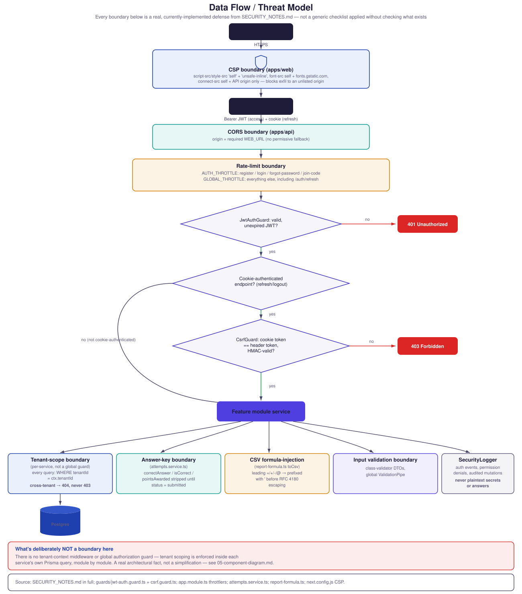

# Data Flow / Threat Model

Every boundary below is a real, currently-implemented defense from
[`SECURITY_NOTES.md`](../../SECURITY_NOTES.md) — not a generic STRIDE
checklist applied without checking what actually exists.

**What's deliberately NOT a boundary here:** there is no tenant-context
middleware or global authorization guard — tenant scoping is enforced
inside each service's own Prisma query, module by module. This is a
real architectural fact, not a simplification for the diagram; see
[`05-component-diagram.md`](./05-component-diagram.md).

**Source:** `SECURITY_NOTES.md` in full; `apps/api/src/auth/guards/`
(`jwt-auth.guard.ts`, `csrf.guard.ts`); `apps/api/src/app.module.ts`
(`ThrottlerGuard`, `AUTH_THROTTLE`/`GLOBAL_THROTTLE`);
`apps/api/src/attempts/attempts.service.ts`
(`loadAttemptDetail`'s answer-key stripping);
`apps/api/src/reports/report-formula.ts` (`toCsv`'s formula-injection
guard); `apps/web/next.config.js` (CSP directives).
