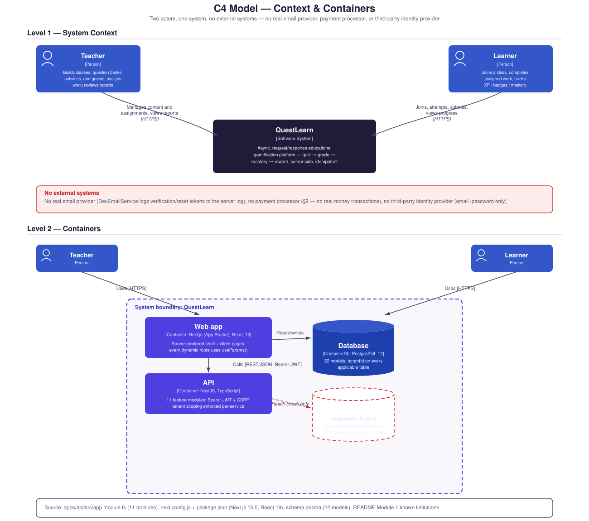

# C4 Model

Two actors, one system, **no external systems** — there is no real
email provider integration (`DevEmailService` logs verification/reset
tokens to the server log instead of sending anything; see README's
Module 1 known limitations), no payment processor (§9: no real-money
transactions), and no third-party identity provider (email+password
only). Combined below: Level 1 (System Context) and Level 2
(Containers).

**Source:** `apps/api/src/app.module.ts` (11 modules),
`apps/web/next.config.js` + `package.json` (Next.js 15.5, React 19),
`apps/api/prisma/schema.prisma` (22 models), README's Module 1 known
limitations (`DevEmailService`, no real provider).
