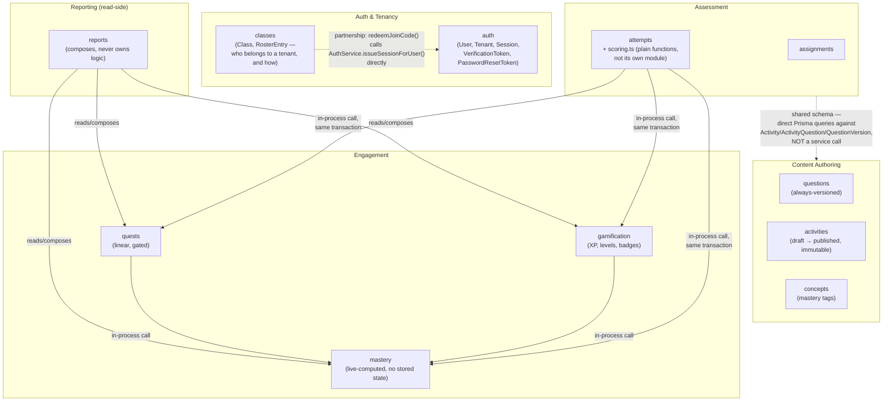

# DDD Context Map

The bounded contexts as they actually emerged across Modules 1–9, not
a textbook DDD carve-up applied after the fact. Grouped by real
`apps/api/src/*/` module boundaries and confirmed integration style —
service-level dependency injection where it exists, and explicitly
NOT where it doesn't.

**A real architectural finding, not a simplification:** Assessment
(`assignments`, `attempts`) never imports `ActivitiesModule` or
`QuestionsModule` — confirmed by grepping every module's `imports:`
array. It reaches published-activity content through its own
`PrismaService` queries against the same Postgres schema, not through
`ActivitiesService`/`QuestionsService`. In strict DDD terms, that
makes Content Authoring and Assessment integrate via a **shared
kernel** (one Postgres schema, no anti-corruption layer) rather than a
published API between contexts — a reasonable choice for a monolith
this size, but a real coupling point, not an isolated one.

**Auth and Classes are a genuine partnership, not just "in the same
folder":** `ClassesService.redeemJoinCode()` calls
`AuthService.issueSessionForUser()` directly to hand a brand-new
learner account a real session in one step — the two contexts are
deliberately coupled here, not accidentally.

**Source:** every `apps/api/src/*/*.module.ts` (`imports:` arrays,
confirmed by grep, matching [`05-component-diagram.md`](./05-component-diagram.md));
`apps/api/src/classes/classes.service.ts` (`redeemJoinCode`'s call
into `AuthService`).
